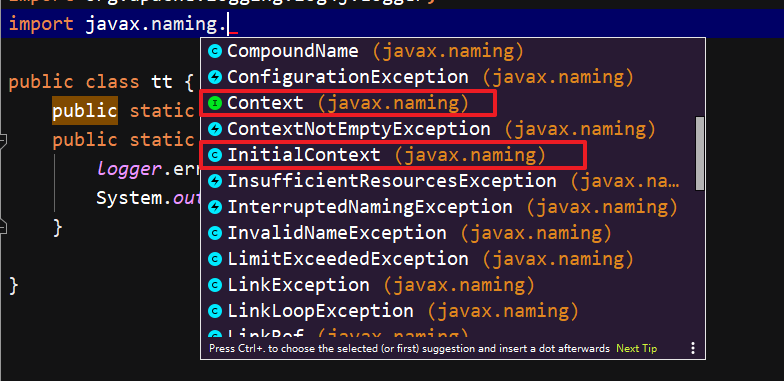

| **Call**     | **This includes method calls, constructor and super constructor invocations, and constructors invoked through class instantiation.** |
| ------------ | ------------------------------------------------------------ |
| **Method**   | **A method is a particular kind of callable.**               |
| **callable** | **A callable is a method or constructor.**                   |
|              |                                                              |

**函数方法**

| **Method**   | **A method is a particular kind of callable.** |
| ------------ | ---------------------------------------------- |
| **callable** | **A callable is a method or constructor.**     |

**函数方法调用**

| **Call**         | **This includes method calls, constructor and super constructor invocations, and constructors invoked through class instantiation.** |
| ---------------- | ------------------------------------------------------------ |
| **MethodAccess** | **A method access is an invocation of a method with a list of arguments.** |


**codeql方法**

| getDeclaringType() | Gets the type in which this member is declared（指向类的定义，而非类的使用） |
| ------------------ | ------------------------------------------------------------ |
| **getCallee()**    | **Gets the target callable of this call  （函数名）**        |


案例

```java
public class LoginHandlerInterceptor implements HandlerInterceptor {
    @Override
    public boolean preHandle(HttpServletRequest request, HttpServletResponse response, Object handler) throws Exception {
        // 用户登录成功后获取session
        Object session = request.getSession().getAttribute("LoginUser");
        if (session == null) {
            request.setAttribute("msg", "请先登录");
            request.getRequestDispatcher("/login").forward(request, response);
            return false;
        } else {
            return true;
        }
    }
}
```

| call            | getCallee() | getDeclaringType() |
| --------------- | ----------- | ------------------ |
| getSession(...) | getSession  | HttpServletRequest |

此处的HttpServletRequest并非指向上面代码中的HttpServletRequest，而是定义HttpServletRequest的java文件中的HttpServletRequest类。


**类的集合**

| RefType | A common super-class for various kinds of reference types, including classes, interfaces, type parameters and arrays. |
| ------- | ------------------------------------------------------------ |
|         |                                                              |

**codeql类的方法**

| getQualifiedName()     | Gets the qualified name of this type, consisting of the package name followed by a `.` and the name of this type. |
| ---------------------- | ------------------------------------------------------------ |
| **hasQualifiedName()** | **Holds if this type is declared in a specified package with the specified name.** |

```java
class Context extends  RefType{
  Context(){
      this.hasQualifiedName("javax.naming", "Context")or
      this.hasQualifiedName("javax.naming", "InitialContext")or
      this.hasQualifiedName("org.springframework.jndi", "JndiCallback")or 
      this.hasQualifiedName("org.springframework.jndi", "JndiTemplate")or
      this.hasQualifiedName("org.springframework.jndi", "JndiLocatorDelegate")or
      this.hasQualifiedName("org.apache.shiro.jndi", "JndiCallback")or
      this.getQualifiedName().matches("%JndiCallback")or
      this.getQualifiedName().matches("%JndiLocatorDelegate") or
      this.getQualifiedName().matches("%JndiTemplate")
  }
}

from Callable p
where p.getDeclaringType() instanceof Context
```

matches不用说，是正则匹配字符串的

上述代码作用：函数集合p，他们的类集合p.getDeclaringType()，这个类集合中筛选出每个类都符合Context的定义的类（instanceof），此操作的同时也意味着筛选p，即：函数集合p中，只留下了对应类p.getDeclaringType()符号Context的定义的子集。（可能有点绕，慢慢想。）

补充，hasQualifiedName的第一个参数是包名，第二个参数是其中的函数名。




