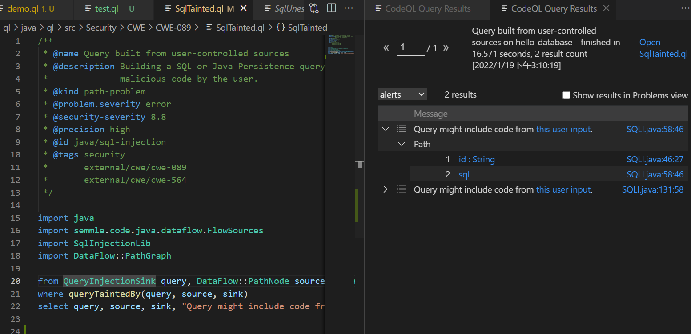
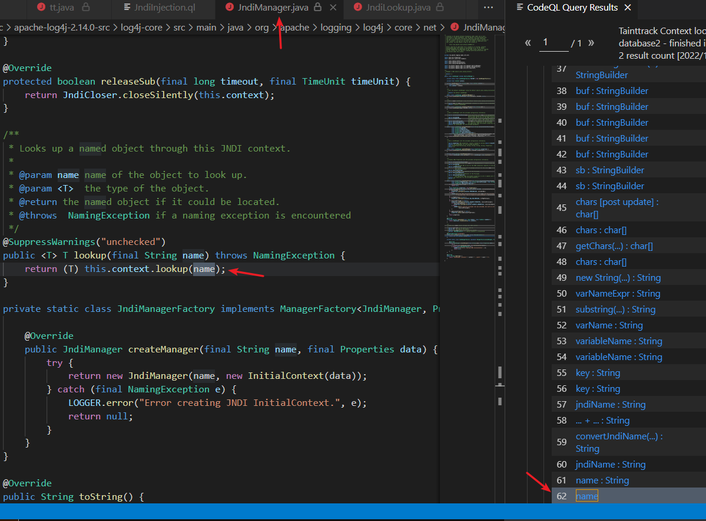

#### 前言

codeql是一款代码审计工具，python、js等解释性语言可以直接进行生成AST数据库，而c、java等语言则需要编译后再生成AST数据库。

对我来说，常规审查交给fortify就行了，但还是需要一款工具来实现自己的规则。听说log4j2是这东西发现的，马上就跑去看看了。

因为是对java代码审计，因此并不会介绍其他语言的操作，不过感觉都是类似的。

#### 参考链接

[CodeQL从入门到放弃](https://www.freebuf.com/articles/web/283795.html)

[代码分析平台CodeQL学习手记（十二）](https://www.4hou.com/posts/gQOZ)

[浅谈利用codeql进行java代码审计分析](https://tttang.com/archive/1322/)

[利用CodeQL分析并挖掘Log4j漏洞](https://mp.weixin.qq.com/s/JYco8DysQNszMohH6zJEGw)


#### 目录

1. 初识：安装及使用
2. codeql语法相关
3. 已有规则库的使用--sql注入
4. 实例：log4j2的漏洞查找


#### 参考链接

[CodeQL从入门到放弃](https://www.freebuf.com/articles/web/283795.html)

#### 配置环境

1. jdk1.8
2. maven 3.8.1


#### 1.初识：安装及使用

参考[CodeQL从入门到放弃](https://www.freebuf.com/articles/web/283795.html)

​		codeql分成两部分，解析引擎+SDK。解析引擎用来解析我们编写的规则，虽然不开源，但是我们可以直接在官网下载二进制文件直接使用。SDK完全开源，里面包含大部分现成的漏洞规则，我们也可以利用其编写自定义规则。

##### 引擎安装

首先在系统上选定CodeQL的安装位置，我的位置为：Home/CodeQL。

然后我们去地址：https://github.com/github/codeql-cli-binaries/releases 下载已经编译好的codeql执行程序，解压之后把codeql文件夹放入～/CodeQL。

为了方便测试我们需要把ql可执行程序加入到环境变量当中：

export PATH=/Home/CodeQL/codeql:$PATH

当然，上面是linux下的，windows中就自己打开环境变量，添加到系统的path参数中。（自行百度如何修改win的环境变量）


在cmd窗口中输入codeql，有返回结果则说明完成安装。


##### SDK安装

直接下载就行了

git clone https://github.com/Semmle/ql


当前目录如下


##### VSCode配置


到此，我们就设置好了CodeQL的开发环境


##### 使用测试“Hello World”

我们需要先生成Database，因为java是编译型语言，我们需要添加command命令进行编译。

样例数据库：**[ Hello-Java-Sec](https://github.com/j3ers3/Hello-Java-Sec)** （参考文章的作者提供的数据库编译失败，自己拿这个）

数据库生成命令：

```cmd
codeql database create hello-database  --language="java"  --command="mvn clean install --file pom.xml" --source-root=Hello-Java-Sec
```

然后vs中选择我们刚才生成的hello-database


vs中打开我们之前下载的SDK


然后在如下路径下创建test.ql，进行java的测试（这下面能够import java 其他路径可能不行，我懒得去找修改方法了，也不碍事）


然后执行语句，点击1处，就能看到下图中2处的结果了


##### 注意

java的源码编译很头疼，如果几个java文件的话可以如下语句

```cmd
javac 1.java 2.java
```

一般的maven源码的话可以尝试上面的

```cmd
mvn clean install --file pom.xml
```

但如果项目中有编译教程的话最好照着做。个人是建议自行成功编译成功一遍后，再把编译命令写入command中进行生成数据库的。后续的log4j 2也在编译这里折磨了很久。


#### 2.codeql语法相关

在此之前还得继续说下数据库，codeql会把源码弄成一个ast数据库，但什么是ast数据库我也不太了解。


这里就简单抄一下原文内容：

我们的类库实际上就是上面AST的对应关系。

怎么理解呢？比如说我们想获得所有的类当中的方法，在AST里面Method代表的就是类当中的方法；比如说我们想过的所有的方法调用，MethodAccess获取的就是所有的方法调用。

我们经常会用到的ql类库大体如下：

|     名称     |                             解释                             |
| :----------: | :----------------------------------------------------------: |
|    Method    |      方法类，Method method表示获取当前项目中所有的方法       |
| MethodAccess | 方法调用类，MethodAccess call表示获取当前项目当中的所有方法调用 |
|  Parameter   |       参数类，Parameter表示获取当前项目当中所有的参数        |


具体语法方面感觉要写的话太多了，这里就提供参考链接好了

1. 还是大佬的那篇[CodeQL从入门到放弃](https://www.freebuf.com/articles/web/283795.html)中的语法部分
2. [代码分析平台CodeQL学习手记（十二）](https://www.4hou.com/posts/gQOZ) （好像要翻墙，但是照着 代码分析平台CodeQL入门 这个关键字搜就行了，这一系列的文章还是挺好入门的）
3. [官方教程](https://codeql.github.com/docs/writing-codeql-queries/ql-tutorials/) （2应该就是这官方里面的翻译部分吧）


#### 3.已有规则库的使用--sql注入

学完语法，自己就对SDK中自带的规则库进行使用下。


上图中的目录就是SDK中自带的java规则库，我们运行CWE-089中的SqlTainted.ql，就能测试Java中的sql注入路径了。



更多的其他xss、jndi等各种漏洞需要自行探索。


#### 4.实例：log4j2的漏洞查找

本节部分会非常啰嗦，当作各种的复习。

##### 前期配置

1. 下载log4j2 2.14.0 :https://archive.apache.org/dist/logging/log4j/2.14.0/
2. 安装jdk9和jdk11（如果只编译log4j2-core的话就不用弄这两个jdk了）

##### 编译数据库

新建toolchains-sample-win2.xml，（log4j2源码目录下有toolchains-sample-win.xml，对其修改就行了），内容


可以自行修改pom.xml中的模块，不对多于模块进行编译。（我懒得改，直接全部编译，然后去玩手机了）


生成数据库命令

```cmd
codeql database create  java-database2  --language="java"  --command="mvn -e clean install -Dmaven.test.skip=true  -Drat.skip=true -t toolchains-sample-win2.xml" --source-root=apache-log4j-2.14.0-src
```

这个属实是改了很多error才跑起来的编译命令了，如果是其他版本的log4j2的话，需要自行测试自己的编译命令是否有用。

##### 编写代码

这部分参考[链接](https://mp.weixin.qq.com/s/JYco8DysQNszMohH6zJEGw)

###### 查找是否存在jndi执行处

我们知道jndi的执行处为lookup函数，如下：

```java
context.lookup(jndiName);
```

他的类名可能是不同的，参考链接中的代码是如下限制类名的

```java
class Context extends  RefType{
  Context(){
      this.hasQualifiedName("javax.naming", "Context")or
      this.hasQualifiedName("javax.naming", "InitialContext")or
      this.hasQualifiedName("org.springframework.jndi", "JndiCallback")or 
      this.hasQualifiedName("org.springframework.jndi", "JndiTemplate")or
      this.hasQualifiedName("org.springframework.jndi", "JndiLocatorDelegate")or
      this.hasQualifiedName("org.apache.shiro.jndi", "JndiCallback")or
      this.getQualifiedName().matches("%JndiCallback")or
      this.getQualifiedName().matches("%JndiLocatorDelegate") or
      this.getQualifiedName().matches("%JndiTemplate")
  }
}
```

Context继承类的集合（其实集合中不止类，不过下面花括号的定义去除了这部分），然后筛选出类名中含特定字符串的类名与函数名的组合的类，或类名符合正则表达式的类。

然后我们如下执行搜索：

```sql
from Call call,Callable p
where
    call.getCallee() = p and 
    p.getDeclaringType() instanceof Context and
    p.hasName("lookup")

select call,p.getDeclaringType()
```

定义了函数调用集合call、函数集合p。p与call构建对应关系`call.getCallee() = p`，然后p的类符合context中的条件，同时p拥有函数名lookup。

结果发现两处存在jndi使用的点。


###### 查找利用jdni的链

log4j2有许多函数的使用方式，以下仅以error函数为入口点进行查询利用链。

要使用codeql中的数据流，需要以下两个包。数据流即codeql中一个参数src到达另一个参数sink的路径。

```java
import semmle.code.java.dataflow.FlowSources
import DataFlow::PathGraph
```


使用样例如下(log4j2漏洞查找的一部分)：

```java
class TainttrackLookup  extends TaintTracking::Configuration {
    TainttrackLookup() { this = "TainttrackLookup" }
    
    override predicate isSource(DataFlow::Node source) {
        exists(LoggerInput LoggerMethod |
            source.asParameter() = LoggerMethod.getAnUntrustedParameter())
    }

    override predicate isSink(DataFlow::Node sink) {
        exists(Expr arg |
            isLookup(arg)
            and
            sink.asExpr() = arg
        )
    }
} 
```

首先我们需要继承`TaintTracking::Configuration`，然后我们需要重新定义isSource和isSink两个函数（或者s说是谓词？）。

首先定义src节点，即我们的error入口点的参数。

```java
class LoggerInput extends  Method {
    LoggerInput(){
        //限定调用的类名、方法名、以及方法只有一个参数
        // this.getDeclaringType() instanceof Logger and
        this.hasName("error") //and this.getNumberOfParameters() = 1
    }

    //将第一个参数作为source
    Parameter getAnUntrustedParameter() { result = this.getParameter(0) }

}
```

LoggerInput继承函数的类（即里面全是函数的类），其限定条件为函数名为error。然后也定义一个函数getAnUntrustedParameter()用来返回error中的第一个参数。此参数就是我们的src节点。

然后重写数据流中的isSource函数：

```java
    override predicate isSource(DataFlow::Node source) {
        exists(LoggerInput LoggerMethod |
            source.asParameter() = LoggerMethod.getAnUntrustedParameter())
    }
```


然后定义我们的sink节点。我们从之前知道了如何查询jndi中的lookup函数，我们只需要返回它的第一个参数当作sink节点即可。

```java
predicate isLookup(Expr arg) {
    exists(MethodAccess ma |
        ma.getMethod().getName() = "lookup"
        and
        ma.getMethod().getDeclaringType() instanceof Context
        and
        arg = ma.getArgument(0)
    )

}
```

传入 参数集合arg。定义函数调用集合ma。ma有着函数名lookup，同时ma的函数的类符合context中的要求。ma筛选后的函数中的首个参数作为arg集合。参数集合arg就是我们的sink节点的参数。

重写数据流中的isSink：

```java
    override predicate isSink(DataFlow::Node sink) {
        exists(Expr arg |
            isLookup(arg)
            and
            sink.asExpr() = arg
        )
    }
```

ps：arg只是参数，而sink是节点，节点的信息要多一些。

执行数据流搜索

```sql
from TainttrackLookup config , DataFlow::PathNode source, DataFlow::PathNode sink
where config.hasFlowPath(source, sink)
select sink.getNode(), source, sink, "unsafe lookup", source.getNode(), "this is user input"
```

结果如下，发现两个error函数（他们的参数不一样），每个error都有4条链到达我们指定的lookup。


###### 验证利用链

在找到后我们必须要验证是否能够使用。这里仅提供我的简单方法。

在上面我们已经找到了利用链，查看链终端的name包



打开idea，在对应处打上断点


调用log4j2的error函数（）

```java
import org.apache.logging.log4j.LogManager;
import org.apache.logging.log4j.Logger;


public class tt {
    public static final Logger logger = LogManager.getLogger();
    public static void main(String[] args) {
        logger.error("${jndi:ldap://localhost:8888/poc}");
        System.out.println(234);
    }
}
```

ps：正确的error里的参数需要在上面调用链中每个节点打上个断点，然后一步步调试得出来，以下使用的${jndi:ldap://localhost:8888/poc}是一个已知的poc，此处进行的是演示，因此不会把全过程写出来。为什么要一步步的打断点调试观察参数呢，因为有时候因为过程中的一些过滤条件，可能不会到达我们所指定的函数。比如把上面的${jndi:ldap://localhost:8888/poc}换成abc就知道了。

调试tt类的main函数，成功到达断点，并且显示参数内容


小总结下：

1. 查询是否存在jndi的执行点。
2. 定义所要审计的包的入口点
3. 修改数据流中src和sink的定义，执行搜索。
4. 验证